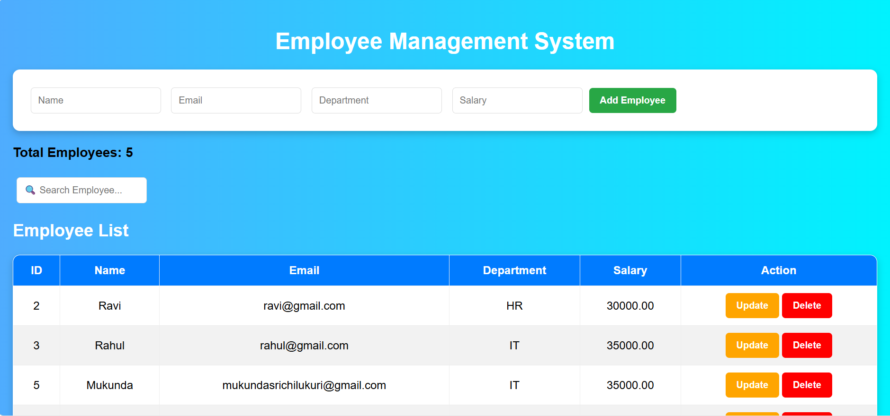

# Employee Management System

## Overview
A full-stack Employee Management System built using HTML, CSS, JavaScript, Node.js, Express.js, and MySQL.

## Features
- Add Employee
- View Employees
- Delete Employee
- Search Employees
- Employee Count
- Success Notifications
- MySQL Database Integration

## Tech Stack
- HTML
- CSS
- JavaScript
- Node.js
- Express.js
- MySQL
- Postman
- GitHub
## Screenshot

### Home Page

## Author
Mukunda Sri Chilukuri